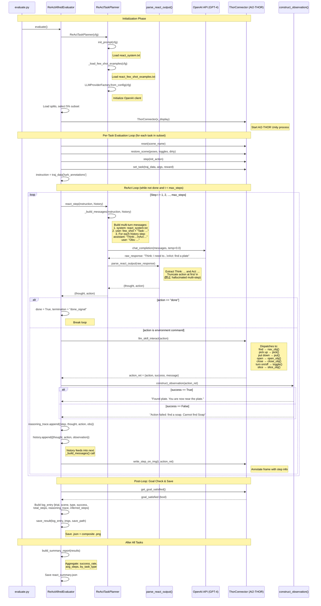

# ReAct Planner Sequence Diagram

## Overview

The ReAct (Reasoning + Acting) planner interleaves LLM-generated thoughts and actions
with environment observations in a closed loop until the task is complete or max steps reached.

## Sequence Diagram



## Message Structure Detail

At step `t`, `_build_messages()` produces this chat history:

```
┌─────────────────────────────────────────────────────┐
│ role: system                                        │
│ content: react_system.txt                           │
│   (actions list, format rules, task procedures)     │
├─────────────────────────────────────────────────────┤
│ role: user                                          │
│ content: react_few_shot_examples.txt + "\n"         │
│          + "Task: Put a plate in a cabinet."        │
├─────────────────────────────────────────────────────┤
│ role: assistant  ← injected from history[0]         │
│ content: "Think: I need to find a plate.\n          │
│           Act: find a plate"                        │
├─────────────────────────────────────────────────────┤
│ role: user       ← injected from history[0]         │
│ content: "Obs: Found plate. You are near the plate."│
├─────────────────────────────────────────────────────┤
│ role: assistant  ← injected from history[1]         │
│ content: "Think: Now I pick it up.\n                │
│           Act: pick up the plate"                   │
├─────────────────────────────────────────────────────┤
│ role: user       ← injected from history[1]         │
│ content: "Obs: You picked up the plate."            │
├─────────────────────────────────────────────────────┤
│ ... (model generates next Think + Act here) ...     │
└─────────────────────────────────────────────────────┘
```

## Data Flow Summary

```
                    ┌──────────────┐
                    │  System Prompt│
                    │  + Few-Shot   │
                    └──────┬───────┘
                           │
              ┌────────────▼────────────┐
              │   _build_messages()     │◄──── history[]
              │   (multi-turn format)   │
              └────────────┬────────────┘
                           │ messages
                    ┌──────▼───────┐
                    │  OpenAI API  │
                    │  (GPT-4)     │
                    └──────┬───────┘
                           │ raw text
                ┌──────────▼──────────┐
                │ parse_react_output()│
                │ Extract Think + Act │
                │ Truncate at \n      │
                └──────────┬──────────┘
                           │ (thought, action)
                    ┌──────▼───────┐
               ┌────┤  "done"?     ├────┐
               │ no └──────────────┘yes │
               │                        │
        ┌──────▼──────┐          ┌──────▼──────┐
        │  AI2-THOR   │          │  Check Goal │
        │  Execute    │          │  Save Result│
        └──────┬──────┘          └─────────────┘
               │ {action, success, message}
     ┌─────────▼─────────┐
     │construct_observation│
     │ → NL observation   │
     └─────────┬─────────┘
               │
        ┌──────▼──────┐
        │ Append to   │
        │ history[]   │──── feeds back to _build_messages()
        └─────────────┘
```
